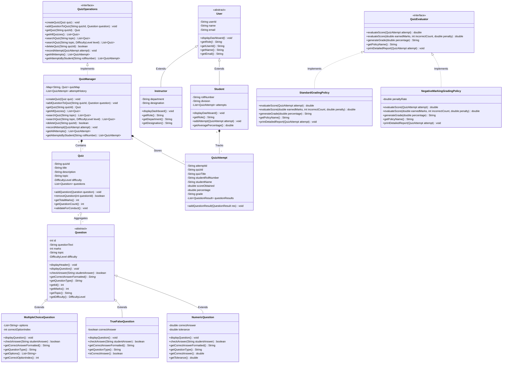
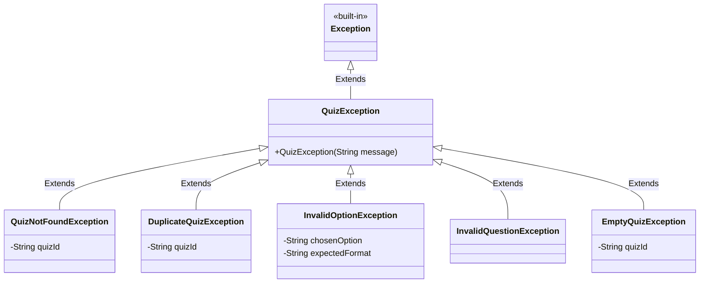
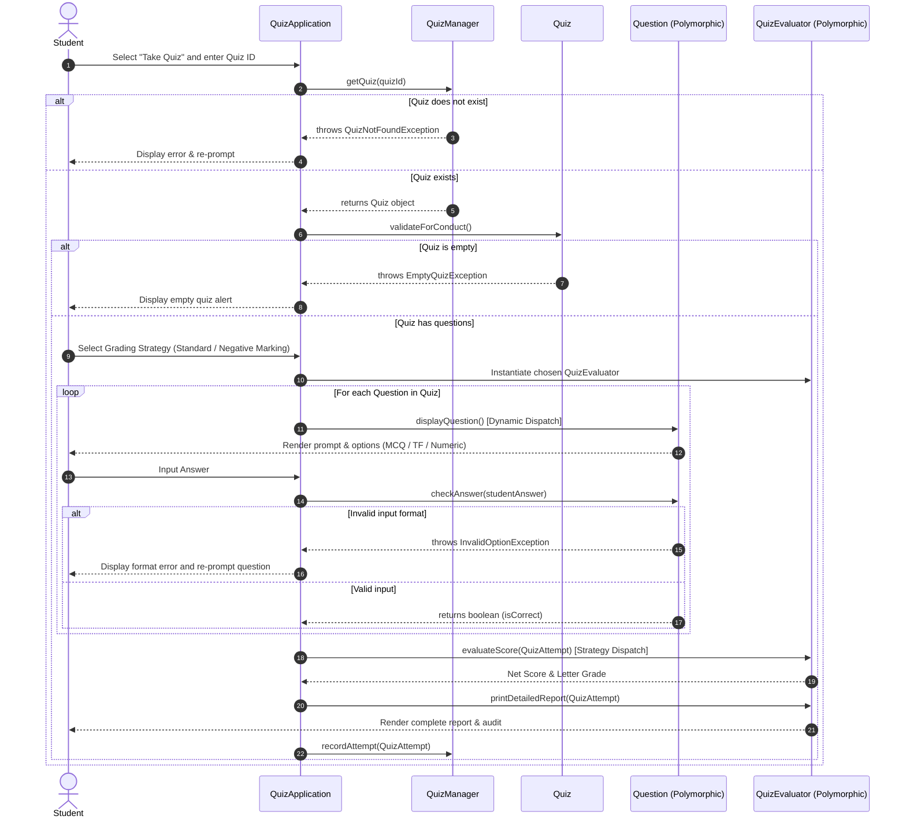

# UML AND ARCHITECTURE DIAGRAMS
## ONLINE QUIZ MANAGEMENT SYSTEM (CIE-2)
**Department of Information Technology, Army Institute of Technology, Pune**

---

## 1. COMPREHENSIVE CLASS DIAGRAM (MERMAID)



---

## 2. EXCEPTION CLASS HIERARCHY



---

## 3. SEQUENCE DIAGRAM: QUIZ ATTEMPT & EVALUATION FLOW



---

## 4. ASCII ARCHITECTURE OVERVIEW

```
+-------------------------------------------------------------------------------+
|                             QuizApplication (Main)                            |
+-------------------------------------------------------------------------------+
         |                                                   |
         v                                                   v
+-----------------------+                         +----------------------+
|    <<interface>>      |                         |    <<interface>>     |
|    QuizOperations     |                         |     QuizEvaluator    |
+-----------------------+                         +----------------------+
         ^                                                   ^
         | implements                                        | implements
+-----------------------+                 +--------------------------+-----------------------+
|      QuizManager      |                 |   StandardGradingPolicy  | NegativeMarkingPolicy |
+-----------------------+                 +--------------------------+-----------------------+
         | contains
         v
+-----------------------+
|         Quiz          |
+-----------------------+
         | aggregates
         v
+-------------------------------------------------------------------------------+
|                              Question (Abstract)                              |
+-------------------------------------------------------------------------------+
         ^                                  ^                                   ^
         |                                  |                                   |
+-----------------------+        +-----------------------+        +--------------------------+
| MultipleChoiceQuestion|        |   TrueFalseQuestion   |        |     NumericQuestion      |
+-----------------------+        +-----------------------+        +--------------------------+
```
